# CL1 - R Circuitos electrónicos #0

Indice evolutivo del las clases del taller + libros y webs de referencia:

[GitHub - Jcspoza/2526_PyR_Index: Curso Programación y Robotica 2025 2026 - CMM BML](https://github.com/Jcspoza/2526_PyR_Index)

## Clase 1 - Indice - 90 minutos

- Materiales y links a información

- Modelo simple de electricidad 

- Montaje#1 : 1eros circuitos : bombilla + batería / Led + pila botón

- Uso de la Protoboard

- Montaje#2 : 2do Circuitos simples en Protoboard:
  
  - bombillas + alimentador 
  
  - led + resistencia + interruptor mecánico

- Ley ohm : Led + resistencia : medida de voltajes y corrientes

- Montaje #3 : interruptor 'reed' m, magnético IC
  
  - led + resistencia + interruptor reed (= lengüetas sensibles a imán) 
  
  - Led + resistencia + Interruptor magnético con IC A3144

- Tabla resumen de programas - Sin programas nuevos

- TO DO

## Materiales y links a informacion

| Material                                                                                                                                                                                                                                | Descripcion                                                                                                                     | Kit SF |
| --------------------------------------------------------------------------------------------------------------------------------------------------------------------------------------------------------------------------------------- | ------------------------------------------------------------------------------------------------------------------------------- |:------:|
| [Protoboard 400 o 700](https://docs.sunfounder.com/projects/kepler-kit/en/latest/component/component_breadboard.html)                                                                                                                   | Placa para prototipos ver apartado [Uso de la protoboard](https://github.com/Jcspoza/2526CL1_R_CircElect0#uso-de-la-protoboard) | SI     |
| [Cables dupond M-M](https://docs.sunfounder.com/projects/kepler-kit/en/latest/component/component_wire.html)                                                                                                                            | Sirven para hacer conexiones en protoboard                                                                                      | SI     |
| [Interruptor deslizante o similar](https://docs.sunfounder.com/projects/kepler-kit/en/latest/component/component_slide_switch.html)                                                                                                     | Para cerrar o abrir un circuito eléctrico                                                                                       | SI     |
| [Interruptor reed](https://docs.sunfounder.com/projects/kepler-kit/en/latest/component/component_reed.html)                                                                                                                             | Responde a un imán cerrando un circuito                                                                                         | SI     |
| [Integrado A3144 sensor efecto hall- video](https://youtu.be/2bhOeZKlR6Q?si=jHhxKIZa2TwwbQ3t) / [datsheet](https://www.elecrow.com/download/A3141-2-3-4-Datasheet.pdf?srsltid=AfmBOoq6nYO8xuLqwHmmPzupl0l0wZYpCiEVHqcGMW1F_LgzDvq2Cq7N) | Responde a un imán, salida en colector abierto, asi que requiere un pull-up                                                     | NO     |

## Modelo simple de electricidad - circuito de agua

Vamos a seguir el modelo simple de electricidad que describe el libro [Electronica para Makers](electronica-para-makers-paolo-aliverti.pdf), donde se compara la electricidad con un circuito de agua (se explicará en la clase)

Especialmente necesario es leer el capitulo 1, y más concretamente los apartados 

- La corriente eléctrica - pag 21

- La tensión o diferencia de potencial - pag 29

- Potencia - pag 35

- La ley de Ohm - pag 42

- Medidas eléctricas pag 47

- La verdad sobre agua y corriente pag 54

### Algunos videos sencillos que pueden ayudar

[ENTIENDE TODA LA ELECTRICIDAD](https://youtu.be/kHdqToHKvQE?si=plQQMs1-ElfcTiw4) Ver desde el minuto 0 al 7 minuto, resto NO

### Avanzado : Modelo mas real de la electricidad en los circuitos

El mas completo en español : [La idea errónea que nos enseñan sobre la electricidad](https://youtu.be/vjFefDCIje0?si=a86zK7UBtTe1QNFz)

Video de explicación y detalles en español sobre el video anterior  [La idea errónea que nos enseñan sobre la electricidad - Parte 1](https://youtu.be/eqwyE7432_s?si=6ujX4dplIVayItcl)

Un articulo completo en ingles : [Understanding-Electricity-and-Circuits-Ian-M-Sefton.pdf](assets/Understanding-Electricity-and-Circuits-Ian-M-Sefton.pdf)

Varios otros videos interesantes: 

Un video corto en ingles : [Convencional current vs electrons flow](https://www.tiktok.com/@theengineeringmindset/video/7548455065560927510)

[Watch electricity hit a fork in the road at half a billion frames per second - YouTube](https://youtu.be/2AXv49dDQJw?si=BoCDWF3X-EOsktdu)

## Montaje#1 : 1eros circuitos : bombilla + batería / Led + pila botón

Lo mejor antes de seguir leyendo o viendo videos es experimentar construyendo circuitos.

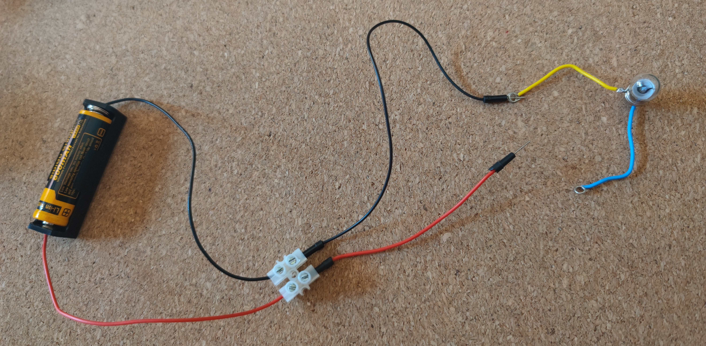

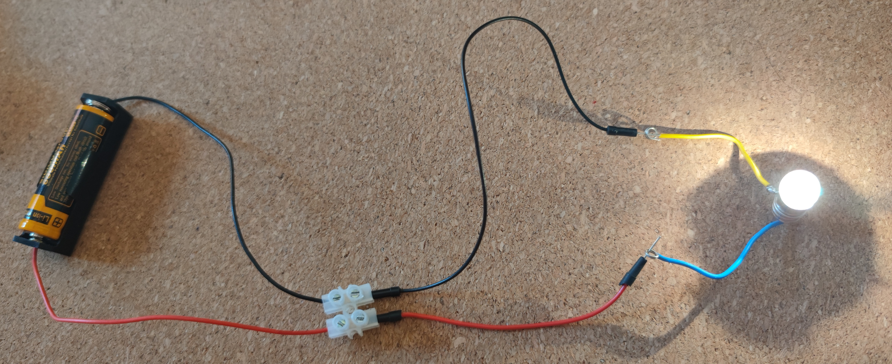

## Uso de la Protoboard

Normalmente no usamos cables para 'armar' circuitos, porque :

- Es muy poco fiable hacer montajes conectando hilos : cualquier movimiento puede desconectar un cable

- Los circuitos pueden ser complicados

- Es poco didáctico y difícil de reproducir

Para montajes de prueba, se suele usar una 'Placa de Pruebas/ Prototipos' o Protoboard o Breadboard :  hay una historia curiosa aqui [ver la Historia de las protoboard](https://na01.safelinks.protection.outlook.com/?url=https%3A%2F%2Fvm.tiktok.com%2FZNdGgYfU9%2F&data=05%7C02%7C%7C72b601b4756e4bdb7ba708de00c64233%7C84df9e7fe9f640afb435aaaaaaaaaaaa%7C1%7C0%7C638949048680897418%7CUnknown%7CTWFpbGZsb3d8eyJFbXB0eU1hcGkiOnRydWUsIlYiOiIwLjAuMDAwMCIsIlAiOiJXaW4zMiIsIkFOIjoiTWFpbCIsIldUIjoyfQ%3D%3D%7C0%7C%7C%7C&sdata=WR2LfBeXH%2BWbmjmLKCMwrI46LXCX7psUIOcVaKi8yBI%3D&reserved=0)

Una Protoboard permite conexiones entre componentes electrónicos con agujeros a distancia standard 0.1”=2.5 mm, algunos de ellos pre-conectados de forma que sirvan en muchos montajes  (ver esquema), sin necesidad de añadir más cables

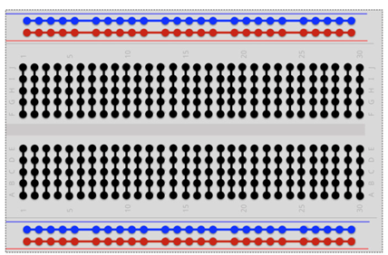

Las conexiones que no hace internamente la Protoboard, se hacen con cables “dupond” macho – macho o con cable rígido en forma de “grapa”.

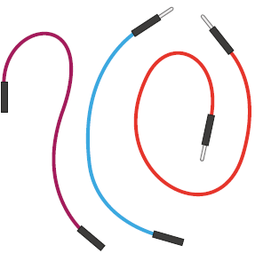

Hay 2 x 2 líneas de alimentación en los laterales porque la mayoría de los componente necesitan ser alimentados a voltaje + y - . Hay 2 líneas diferentes porque en ocasiones usaremos 2 voltajes en los montajes, normalmente 5 y 3.3 voltios. Si solo usamos un voltaje , el tener dos líneas acortará algunas conexiones. 

**IMPORTANTE** : si 1 montaje tiene 2 alimentaciones con voltajes distintos, los negativos ( o GND) han de unirse / si el voltaje es solo uno pero usamos las 4 líneas de la protoboard, uniremso los '+'  (rojo) y los '-' (negro)

Hay 3 tamaños de Protoboard mas comunes : 170, 400 y 832 agujeros. En el kit de sunfounder viene una de 832. Recomendación: tener 1 o 2 protoboard de 400

## Montaje#2 : 2do Circuitos simples en Protoboard:

### 2.1 bombillas + alimentador+ interruptor mecánico

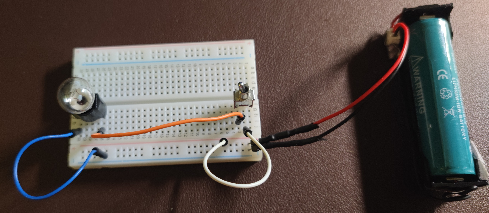

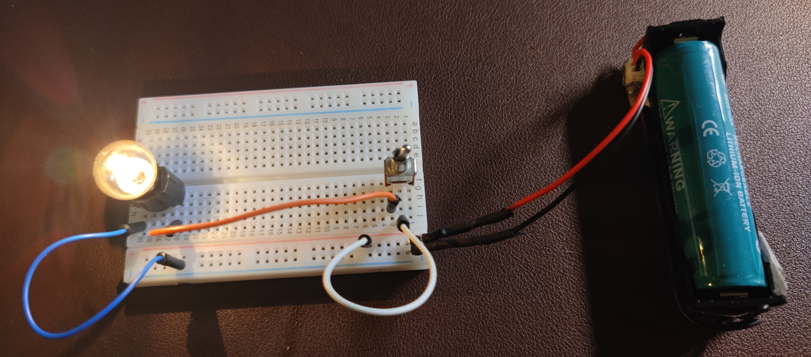

### 2.2 led + resistencia + interruptor mecánico

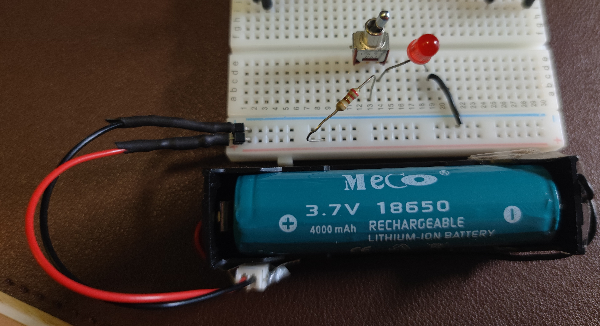

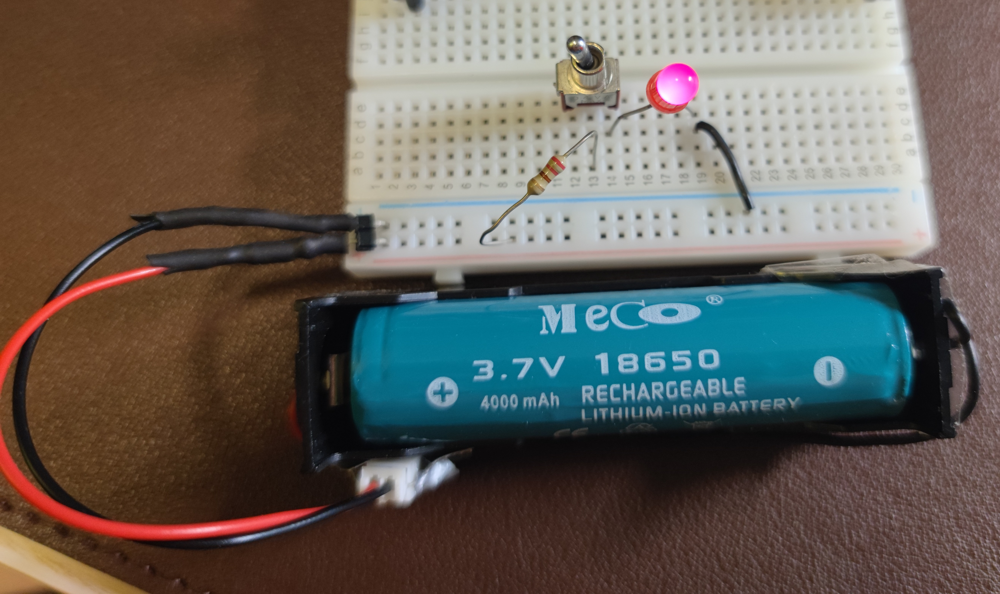

## Montaje #3 : interruptor 'reed' + magnético IC

### 3.1 led + resistencia + interruptor reed

#### Interruptor reed

Vamos a sustituir el interruptor mecánico por un interruptor magnético : que es un ampolla con dos laminas normalmente separadas que cerca de un imán de juntan para cerrar el circuito

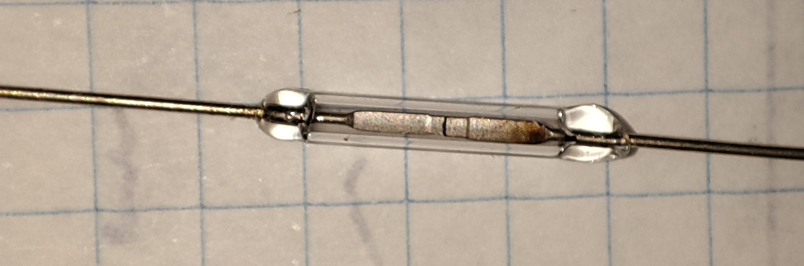

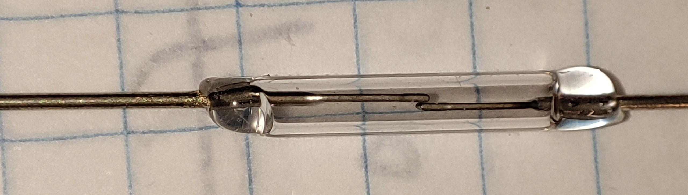

#### Montaje led + resistencia + interruptor reed

Vamos a montar un circuito en la Protoboard como el siguiente esquema:

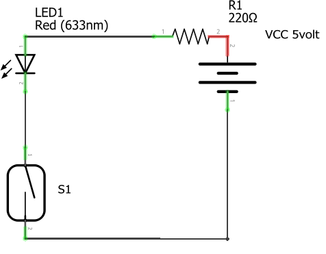

S1 es un interruptor 'reed'. En la Protoboard quedaría asi

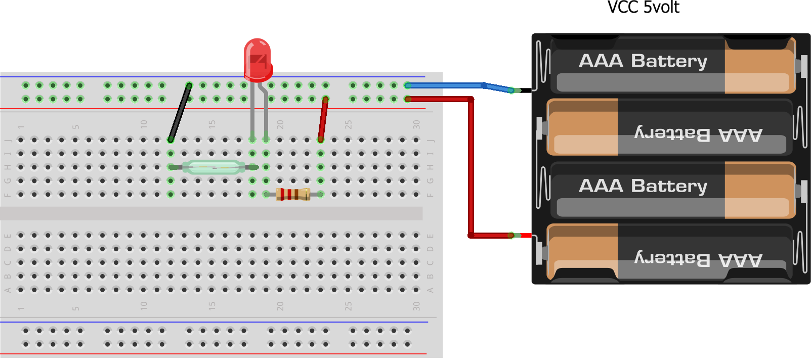

#### Prueba de funcionamiento

Acerca un imán al circuito y el LED lucirá

### 3.2 Led + resistencia + Interruptor magnético con IC A3144

#### Integrado A3144

Es un circuito integrado que usa el efecto hall para detectar campos magnéticos. Da una respuesta todo-nada. Video [Sensor de efecto HALL A3144 Unipolar #efectohall #sensorhall - YouTube](https://youtu.be/2bhOeZKlR6Q?si=jHhxKIZa2TwwbQ3t)). Tiene la salida en colector abierto ( no lo explicaré en esta lección) , lo que hace que requiera una resistencia de pull-up = conectada al positivo de la batería, que normalmente es de un valor alto como 10kohm

#### Montaje Led + resistencia + IC A3144

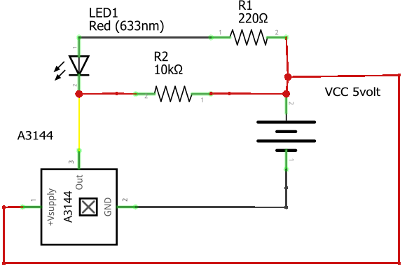

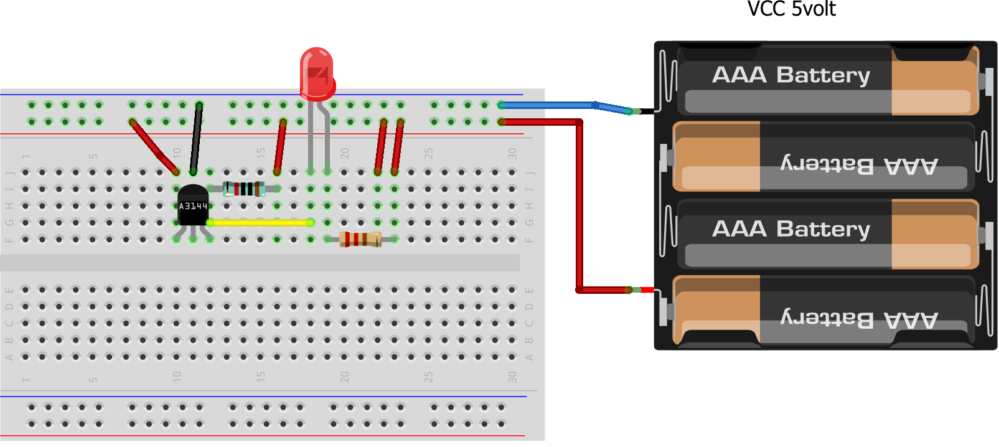

#### Prueba de funcionamiento

Acerca un imán al circuito y el LED lucirá

## ( si da tiempo) Ley ohm : Led + resistencia : medida de voltajes y corrientes

Re leemos 

Medidas eléctricas pag 47

### Simulador super sencillo

[OhmZone - Circuit Simulator](https://www.article19.com/circuit-simulator/)

### Caso real

Usaremos los mismos circuitos de led + resistencia que hemos construido, para medir voltajes y corrientes: ¡Manos a la obra!

## Tabla resumen de programas - Sin programas nuevos

| Programa | Lenguaje | HW si Robotica y Notas | Objetivo de Aprendizaje |
| -------- | -------- | ---------------------- | ----------------------- |
|          |          |                        |                         |

---

## TO DO :

1. Usar interruptor reed con Pico , siendo el interruptor reed entrada On/off 
